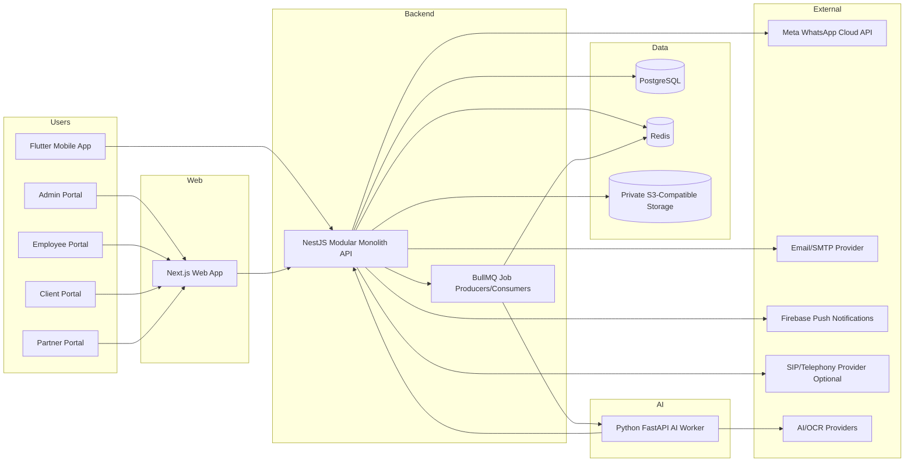

# Tashfeen Immigration Solutions AI Platform

# Technical Solution Document For Review

Version: 1.0  
Prepared date: May 10, 2026  
Status: Review draft  
Prepared for: Tashfeen Immigration Solutions technical review and coordination  
Prepared from: existing project repository, Week 1 technical outputs, development standards, proposal revision package, current Prisma schema, local/staging Docker files, and mobile API contract

Usage note: This document can be shared with the Summit/development team as the written technical review baseline if a meeting session is not convenient. The tone and content are intended for professional alignment, not daily team interference.

---

## 1. Purpose Of This Document

This Technical Solution Document is prepared to bridge the gap between the requirements already shared for the Tashfeen Immigration Solutions AI Platform and the level of technical clarity required before execution proceeds with confidence.

The purpose is to review whether the proposed solution has:

- clear architecture
- practical deployment model
- manageable OPEX
- security approach
- ownership clarity
- handover process
- realistic dependency plan
- acceptance and UAT checkpoints

This is a standard software project review document. It is not intended to interrupt the development team or change the agreed business direction. It gives Tashfeen Immigration Solutions a structured basis to review the proposed solution, ask practical questions, confirm assumptions, and proceed with alignment.

---

## 2. Executive Summary

The recommended Version 1 solution is an enterprise CRM and automation platform for Tashfeen Immigration Solutions, built as a modular monolith with separate web, backend, AI worker, mobile, database, queue, and private storage components.

The approved technology direction is:

| Layer | Recommended Technology |
| --- | --- |
| Web portals | Next.js, React, TypeScript |
| Backend API | NestJS, Node.js, modular monolith |
| Database | PostgreSQL |
| ORM and migrations | Prisma |
| Queue and jobs | Redis and BullMQ |
| AI worker | Python FastAPI |
| File storage | S3-compatible private object storage |
| Mobile app | Flutter |
| Deployment | Dockerized local, staging/UAT, and production |

The architecture avoids premature microservices. Version 1 should remain a clean modular monolith because it is easier to build, secure, deploy, test, and maintain within the current project budget and timeline. A separate AI worker is used only for slow or specialized AI/OCR/transcription jobs.

The platform must enforce backend security, not frontend-only permission hiding. Every protected action must pass authentication, RBAC permission checks, ownership checks, workflow status checks, validation, and audit logging where required.

The deployment model should include local development, staging/UAT, and production environments. Staging must be available before milestone UAT and production deployment.

The OPEX can be controlled by starting with a practical containerized deployment, managed PostgreSQL, Redis, private object storage, monitoring, backups, and usage-based AI/WhatsApp services. AI, OCR, WhatsApp, telephony, and storage costs must be tracked separately because they depend on actual usage and provider approvals.

---

## 3. Business Context

Tashfeen Immigration Solutions requires a long-term operational system for immigration consultancy workflows. The platform should support daily office operations across leads, clients, consultants, cases, documentation, processing, finance, appointments, WhatsApp communication, partner/referral activity, client portal access, mobile access, reporting, and AI-assisted workflows.

The system should be built as a real business platform, not a demo or temporary website. Important design priorities are:

- role-aware work queues
- client and case ownership controls
- audit logs for sensitive actions
- readable activity timelines for staff visibility
- secure document handling
- controlled WhatsApp communication
- configurable statuses, services, countries, departments, and document requirements
- staging-tested releases
- clean handover and support process

---

## 4. Version 1 Scope

### 4.1 In Scope

Version 1 includes the following core areas:

| Area | Scope |
| --- | --- |
| Admin portal | Users, roles, permissions, departments, branches, services, countries, settings, reports, audit visibility |
| Employee portal | Assigned leads, client/case work queues, follow-ups, notes, timelines, appointments, documentation, processing, finance actions by role |
| Client portal | Own case status, document checklist, document upload, appointments, payments/receipts, notifications |
| Partner/referral portal | Referral submission, limited own referral tracking, communication with Tashfeen team |
| Lead CRM | Lead intake, duplicate checks, assignment, reassignment, follow-ups, conversion to client/case |
| Client and case management | Client profile, case records, case stages, handovers, escalations, activity timelines |
| Documents | Requirements by visa/service and target country, upload, private storage, review, verify, reject, replacement request |
| Communications | WhatsApp webhook, conversation storage, template handling, bot flow state, human handover |
| Appointments | Booking, calendar, reschedule, cancellation, reminders |
| Finance | Invoices, payments, receipts, installments/refunds where approved, payment verification |
| Reports | Lead, operations, appointment, finance, employee, export logs |
| Audit and timeline | Immutable audit logs plus readable activity timeline entries |
| AI jobs | OCR, document classification, summaries, transcripts, suggested replies, business plan drafts, all with human review |
| Mobile app | Flutter employee/client login, dashboard, assigned work, case status, document upload, appointments, notifications, attendance basic |
| Phase 2 basic | Attendance, device registry, operational monitoring basics, subject to confirmed policy |

### 4.2 Out Of Scope Unless Separately Approved

The following should not be treated as included unless there is a written change request:

- full ERP replacement
- full accounting/payroll system
- advanced endpoint control or enterprise device management
- advanced biometric attendance enforcement
- guaranteed Meta/WhatsApp template approval
- guaranteed app store approval
- guaranteed AI accuracy or final automated immigration/legal/financial decisions
- guaranteed recordability of WhatsApp app calls
- new modules, reports, integrations, or major redesigns after scope approval

---

## 5. Current Repository Baseline

The current repository is already structured as a monorepo with separate apps and packages:

| Path | Purpose |
| --- | --- |
| apps/backend | NestJS backend API |
| apps/frontend | Next.js web portals |
| apps/ai-worker | Python FastAPI AI worker placeholder/service area |
| apps/mobile | Flutter mobile app |
| packages/shared-types | Shared TypeScript types |
| packages/shared-utils | Shared utilities |
| infra | Docker and infrastructure support |
| week-1-technical-outputs | Architecture, ERD, RBAC, API map, sitemap, design system, DevOps plan, backlog, risk register |

Current backend module folders include:

- activity-timeline
- appointments
- audit-log
- auth
- branches
- cases
- clients
- countries
- departments
- documents
- employees
- finance
- follow-ups
- health
- leads
- partners
- permissions
- reports
- roles
- services
- storage
- users

Current frontend route groups include:

- admin portal
- auth routes
- client portal
- employee portal
- partner portal

Current shared frontend components include reusable items such as DataTable, FilterBar, StatusBadge, PermissionGate, ConfirmationDialog, EmptyState, LoadingState, ErrorState, PageHeader, and StatCard.

Current mobile feature areas include auth, dashboard, leads, cases, documents, appointments, and notifications.

Important note: folder presence and schema presence should be treated as implementation baseline, not final UAT acceptance. Each module still needs endpoint verification, UI verification, RBAC verification, ownership tests, audit tests, and staging UAT.

---

## 6. Architecture Decision

### 6.1 Approved Version 1 Architecture

The approved Version 1 architecture is:

- Web portals in Next.js, React, TypeScript.
- Backend API in NestJS, Node.js, modular monolith.
- PostgreSQL as the source of truth.
- Prisma for schema, migrations, and database access.
- Redis and BullMQ for queue/background jobs.
- Python FastAPI AI worker for AI/OCR/transcription tasks.
- S3-compatible private object storage for documents and files.
- Flutter mobile app using the same backend APIs.
- Dockerized local, staging/UAT, and production environments.

### 6.2 Why Modular Monolith

A modular monolith is the right choice for Version 1 because:

- the platform has many connected workflows that share users, clients, cases, documents, finance, and audit data
- one backend is easier to secure consistently
- database transactions are simpler across modules
- deployment is cheaper and easier than multiple microservices
- development speed is better for the current delivery timeline
- future extraction to services remains possible if traffic or team size later justifies it

Microservices should not be introduced in Version 1 unless there is a documented business and technical reason.

### 6.3 Separate AI Worker

The AI worker is separate from the backend API because AI/OCR/transcription work can be slow, retryable, and provider-dependent.

The backend should create an AI job, enqueue work through BullMQ, and let the Python FastAPI worker process it. The backend remains the system of record and stores the output, status, review state, and audit events.

AI must assist staff only. It must not approve documents, reject clients, give final legal/immigration/financial advice, or make final case decisions.

---

## 7. High-Level Architecture Diagram

---

## 8. Runtime Components

### 8.1 Web Portals

The web application should provide role-aware portals:

- Admin portal
- Employee portal
- Client portal
- Partner/referral portal

The frontend should use shared layout, reusable components, central design tokens, and status configuration. Permission hiding in the frontend is only for user experience. Backend guards remain mandatory.

### 8.2 Backend API

The backend is the main business system. It owns:

- authentication
- RBAC and ownership checks
- validation
- workflow state transitions
- audit logging
- activity timeline creation
- API responses
- database access
- signed file URL generation
- queue job creation
- integration coordination

Each backend module should follow a clean structure:

- controller
- service
- repository or data access layer
- DTOs
- validators
- guards
- audit logging
- tests where practical

### 8.3 PostgreSQL

PostgreSQL is the source of truth for operational data.

Important schema areas include:

- organization, branches, departments, designations
- users, roles, permissions, user roles, sessions, password resets
- employees, clients, partners
- leads, follow-ups, assignments, conversion references
- cases
- document requirements and client documents
- appointments
- invoices, payments, finance handovers
- audit logs
- activity timeline
- AI jobs
- attendance records

Important indexes must exist for:

- lead phone and email
- client phone and email
- lead status
- assigned employee queues
- case status
- document status
- payment status
- appointment date
- audit entity lookup
- activity timeline lookup
- AI job status and job type

### 8.4 Redis And BullMQ

Redis and BullMQ should handle:

- WhatsApp sends and retry
- webhook processing retry
- email and push notifications
- appointment reminders
- OCR/document classification
- AI summaries and drafts
- voice transcription
- report exports
- scheduled cleanup and status checks

Request/response APIs should not block while waiting for slow AI or integration work.

### 8.5 AI Worker

The AI worker should process queued jobs and return structured output.

Supported AI job types may include:

- OCR extraction
- document classification
- document expiry detection
- voice/call transcription
- call or interview summaries
- suggested replies
- business plan draft generation

Each AI output should store:

- input reference
- job type
- provider/model
- prompt or template version
- output payload
- status
- error if failed
- reviewed_by_user_id
- review_status
- timestamps

### 8.6 Private Object Storage

All sensitive files must be stored privately. This includes:

- client documents
- receipts
- uploaded proofs
- generated PDFs
- call recordings where legally approved
- AI-related file inputs and outputs where needed

Files must not be exposed through public URLs. The backend should issue short-lived signed URLs only after permission and ownership checks.

### 8.7 Flutter Mobile App

The Flutter app should use the same backend APIs and the same server-side permission rules.

Mobile Version 1 should focus on:

- employee login
- client login
- employee dashboard
- client dashboard
- assigned leads/tasks
- case status
- document upload
- appointments
- notifications
- attendance check-in/out basic

Mobile should not carry every admin feature in Version 1.

---

## 9. Core Data Ownership Model

Data access must be scoped by ownership fields, not only by role labels.

Important ownership dimensions:

| Ownership Field | Purpose |
| --- | --- |
| branch_id | branch-level access and reporting |
| department_id | department queues and processing ownership |
| assigned_employee_id | assigned work queues and employee-level access |
| client_id | client-owned records, documents, payments, appointments |
| lead_id | lead lifecycle and conversion tracking |
| case_id | case-specific documents, appointments, notes, finance links |
| partner_id | partner/referral ownership and limited partner visibility |

Access rules should answer three questions for every protected record:

1. Is the user authenticated?
2. Does the user have the required permission key?
3. Is the user allowed to access this specific record based on assignment, branch, department, client ownership, or partner ownership?

Workflow actions must also check current status. For example, a converted lead should not be converted again, a verified document should not be rejected without an allowed transition, and a finance payment should not be verified by an unauthorized role.

---

## 10. Main Business Workflows

### 10.1 Lead Intake And Assignment

1. Lead arrives from WhatsApp, website form, manual entry, campaign source, or partner/referral.
2. Backend validates required data such as name, phone, visa/service, target country, source, and consent where applicable.
3. Duplicate check runs against phone/email and similar identifying data.
4. Lead is created with status, source, branch, service interest, target country, and owner fields.
5. Assignment engine or admin assigns the lead to a consultant/employee.
6. Audit log records creation and assignment.
7. Activity timeline records readable lead lifecycle event.
8. Assigned employee sees the lead in their queue.

### 10.2 Lead Conversion To Client And Case

1. Consultant qualifies a lead.
2. Backend checks permission, ownership, and allowed lead status.
3. Lead is converted to client and case.
4. Case is assigned to the correct department or employee.
5. Handover notes and required context are saved.
6. Audit log records conversion.
7. Activity timeline shows the readable conversion and case opening.

### 10.3 Document Upload And Review

1. Client or staff uploads a document.
2. Backend stores file privately and creates client document metadata.
3. Backend enqueues OCR/classification job where enabled.
4. AI worker returns suggested classification, extracted fields, expiry, and quality flags.
5. Documentation officer reviews the file and AI suggestion.
6. Officer verifies, rejects, or requests replacement.
7. Audit log captures access and decision.
8. Activity timeline informs staff and client where appropriate.

### 10.4 WhatsApp Communication And Handover

1. Meta webhook receives inbound WhatsApp message.
2. Backend verifies webhook signature/token.
3. Message is stored under conversation history.
4. Bot flow may collect basic screening information if approved.
5. Human handover occurs when needed.
6. Consultant or support staff replies through allowed templates or session messaging.
7. Provider failures are logged and retried where practical.
8. Sensitive message sends are audited where required.

### 10.5 Appointment Workflow

1. Staff or client requests an appointment.
2. Backend checks appointment type, availability, assigned employee, and client/lead relation.
3. Appointment is booked, rescheduled, completed, canceled, or marked no-show.
4. Reminder jobs are scheduled through queue.
5. Activity timeline and notifications are updated.
6. Changes are audited where sensitive.

### 10.6 Finance Workflow

1. Invoice or payment record is created for a lead/client/case.
2. Payment proof or receipt is uploaded privately where required.
3. Finance officer verifies payment.
4. Invoice, payment, and receipt statuses are updated.
5. Client sees only allowed finance information.
6. Audit log records payment creation, verification, refunds, and receipt actions.
7. Reports use finance data with role-based restrictions.

### 10.7 AI Job Workflow

1. Staff or system triggers AI-supported task.
2. Backend validates permission and creates ai_job record.
3. Job is queued through BullMQ.
4. AI worker processes the job.
5. Output is stored with provider/model/prompt version.
6. Staff reviews and accepts/rejects/edits output.
7. Review action is audited.

---

## 11. API Design Approach

### 11.1 API Principles

APIs should be predictable, REST-style, typed, validated, and permission-bound.

Every protected endpoint must define:

- request body
- response body
- validation rules
- permission key
- ownership/access rules
- workflow status rules where applicable
- audit log behavior
- possible error responses

Common error responses:

| Status | Code |
| --- | --- |
| 400 | validation_failed |
| 401 | unauthenticated |
| 403 | forbidden |
| 404 | not_found |
| 409 | conflict |
| 422 | invalid_state_transition |
| 429 | rate_limited |
| 500 | internal_error |

### 11.2 Required API Groups

| Group | Example Routes |
| --- | --- |
| Auth | POST /auth/login, POST /auth/logout, POST /auth/refresh, GET /auth/me, password reset/change routes |
| Users/RBAC | GET/POST /users, PATCH /users/:id, GET/POST /roles, role permission assignment, permissions list |
| Departments/branches | GET/POST /departments, PATCH /departments/:id, GET/POST /branches |
| Services/countries/settings | Configurable visa/service, target country, statuses, document requirements |
| Leads | POST /leads, GET /leads, GET /leads/:id, PATCH /leads/:id, assign, reassign, convert, reject |
| Follow-ups | Create/update/complete follow-ups and assigned task queues |
| Partners/referrals | Partner management, referral submission, limited referral tracking |
| Clients/cases | Client list/detail, case list/detail, status update, handover, escalation, notes, timeline |
| Documents | Requirements, upload, list, signed URL, review, verify, reject, request replacement |
| Communications | WhatsApp webhook, conversations, messages, templates, bot flows, human handover |
| Appointments | List, book, reschedule, cancel, reminders |
| Finance | Invoices, payments, verification, receipts, refunds, finance reports |
| Reports | Operations, leads, appointments, finance, employee, exports |
| Audit/timeline | Audit logs for admins, readable timeline for lead/client/case screens |
| AI jobs | Create AI job, get status/output, review output |
| Mobile | Auth and role-scoped dashboard/workflow APIs consumed by Flutter |

---

## 12. RBAC And Permission Model

### 12.1 Core Roles

Recommended roles:

- Super Admin
- Admin/Manager
- Sales/Consultant
- Documentation Officer
- Processing Officer
- Finance Officer
- Support/Call Center
- Marketing
- Client
- Partner/Referral

### 12.2 Permission Key Groups

Example permission groups:

| Module | Example Permission Keys |
| --- | --- |
| Users/RBAC | users.view, users.create, users.update, users.deactivate, roles.view, roles.manage |
| Leads | leads.view_all, leads.view_assigned, leads.create, leads.update, leads.assign, leads.convert, leads.reject |
| Clients | clients.view_all, clients.view_assigned, clients.view_own, clients.update, clients.timeline.view |
| Cases | cases.view_all, cases.view_assigned, cases.update_status, cases.handover, cases.escalate |
| Documents | documents.view_all, documents.view_assigned, documents.view_own, documents.upload, documents.review, documents.verify, documents.reject |
| Finance | finance.view_all, finance.view_related, finance.create_payment, finance.verify_payment, finance.manage_invoice, finance.refund |
| Communications | communications.view_all, communications.view_assigned, communications.send_whatsapp, communications.handover, communications.manage_templates |
| Reports | reports.view, reports.export |
| Audit | audit.view |
| Settings | settings.manage, integrations.manage |
| AI | ai_jobs.create, ai_outputs.review |
| Devices/attendance | devices.manage, attendance.check_in_out, attendance.view_team, attendance.override |

### 12.3 Enforcement Rules

Backend enforcement must always check:

1. user authentication
2. required permission key
3. record ownership or allowed scope
4. current workflow status
5. input validation
6. audit log requirement

Frontend permission hiding is required for usability but must not be treated as security.

---

## 13. Security Design

### 13.1 Authentication

Recommended authentication model:

- email/password login
- password hashing with bcrypt or Argon2id using appropriate cost settings
- short-lived access token
- refresh token with rotation and revocation
- secure session storage
- account lock after repeated failed login attempts
- password reset with short-lived token
- optional MFA-ready structure for admin accounts

The mobile API contract already defines:

- access token stored in memory only
- refresh token stored in FlutterSecureStorage
- token rotation on refresh
- lock after repeated failed login attempts

For web, secure HttpOnly cookie-based session handling is preferred where practical. If bearer tokens are used, storage must avoid unsafe long-term browser storage.

### 13.2 Authorization And Data Isolation

Authorization must combine RBAC and ownership checks.

Examples:

- Sales/consultant sees assigned leads and assigned clients only unless granted wider permission.
- Documentation officer sees document queues allowed by department/assignment.
- Processing officer sees assigned cases or department queues.
- Finance officer sees finance data needed for payment verification and reporting.
- Client sees own profile, own case, own documents, own appointments, own payment records.
- Partner/referral user sees only own referrals and limited safe status.
- Audit logs are admin/super admin only.

### 13.3 File Security

File rules:

- no public document URLs
- private S3-compatible bucket
- file metadata stored in PostgreSQL
- signed URLs generated only after backend permission check
- signed URL expiry should be short
- sensitive document views may be logged
- upload file type and size validation required
- retention policy required before production

### 13.4 Audit Logs And Activity Timeline

Audit logs and activity timelines are separate concepts.

Audit logs are immutable technical/security records. They should include:

- actor_user_id
- action
- entity_type
- entity_id
- old_values
- new_values
- ip_address
- user_agent
- created_at

Activity timeline entries are readable business events shown on lead/client/case screens.

Sensitive actions to audit include:

- login/logout and failed login
- user/role/permission changes
- lead assignment/reassignment/conversion/rejection
- client profile updates
- case status changes
- department handovers
- document upload/view/review/reject/replacement
- payment/invoice/receipt/refund changes
- report export
- WhatsApp message sent
- AI output reviewed
- admin setting changes
- device access changes
- attendance manual override

### 13.5 Secrets And Environment Variables

Secrets must not be committed to the repository.

Required secret categories:

- DATABASE_URL
- Redis connection details
- JWT/session secrets
- object storage keys
- WhatsApp/Meta credentials
- email/SMTP credentials
- AI/OCR provider keys
- telephony credentials where used
- Firebase credentials
- payment gateway credentials where used

Each environment must have separate credentials.

### 13.6 AI Privacy And Human Review

AI is assistive only.

Rules:

- reduce personal data sent to external AI providers where practical
- store AI provider/model/prompt version for traceability
- keep AI output reviewable by staff
- never let AI approve or reject documents automatically
- never let AI make final legal, immigration, financial, or case decisions
- audit review of sensitive AI output

### 13.7 Backups And Recovery

Minimum backup requirements:

- daily PostgreSQL backup
- object storage retention/versioning where available
- periodic restore test
- backup access limited to authorized technical admins
- backup health monitoring
- documented restore steps before production

### 13.8 Monitoring And Incident Response

Monitor:

- API health
- web app availability
- database health
- Redis/queue health
- failed jobs
- webhook failures
- failed login spikes
- error logs
- slow requests
- storage usage
- AI/OCR failures

Incident response should classify severity, owner, impact, customer communication need, resolution steps, and post-incident prevention.

---

## 14. Deployment Model

### 14.1 Environment Strategy

Use three environment levels:

| Environment | Purpose |
| --- | --- |
| Local development | Developer testing with Docker Compose and local services |
| Staging/UAT | Client testing, milestone review, integration verification |
| Production | Live system after approval and release checklist |

Staging must exist before milestone UAT. Production should not receive direct untested changes.

### 14.2 Local Development

Local development should run:

- Next.js web app
- NestJS backend
- Python FastAPI AI worker
- PostgreSQL
- Redis
- MinIO or S3-compatible local storage

The current local Docker Compose already provides PostgreSQL, Redis, and MinIO.

### 14.3 Staging/UAT

Staging should include:

- web app service
- backend API service
- AI worker service where AI jobs are being tested
- queue worker process if separated from backend runtime
- PostgreSQL
- Redis
- private object storage
- HTTPS domain/subdomains
- separate environment variables
- health checks
- deploy/rollback process

Suggested staging domains:

- admin-staging.tashfeen-domain
- client-staging.tashfeen-domain
- api-staging.tashfeen-domain
- webhooks-staging.tashfeen-domain

Final domains must be confirmed by Tashfeen and the deployment team.

### 14.4 Production

Production requirements:

- HTTPS everywhere
- separate production database
- separate production Redis
- separate production object storage bucket/prefix
- production secrets outside source code
- database backup policy active
- object storage retention/versioning where available
- monitoring and error logging active
- queue failure alerts active
- webhook verification active
- release rollback plan ready
- production deployment checklist completed

### 14.5 CI/CD Pipeline

Minimum CI/CD pipeline:

1. Install dependencies.
2. Lint backend/frontend/mobile where applicable.
3. Type check.
4. Run tests.
5. Build frontend.
6. Build backend.
7. Validate Prisma migrations.
8. Build Docker images where used.
9. Deploy develop branch to staging.
10. Run smoke tests.
11. Manual approval for production deployment from main.
12. Deploy production.
13. Run post-deploy health checks.

### 14.6 Database Migration Process

Rules:

- use reviewed Prisma migration files
- run migrations on staging first
- backup production before risky migrations
- never manually change production database without logged approval
- define rollback steps for high-risk migrations
- keep seed scripts safe and environment-aware

### 14.7 Rollback Process

Rollback plan should include:

- application image rollback
- database migration rollback strategy where possible
- backup restore decision criteria
- environment variable rollback
- queue worker pause/resume steps
- communication owner and incident record

---

## 15. OPEX Model

### 15.1 OPEX Principle

OPEX should be manageable by keeping Version 1 as a modular monolith, containerizing services, avoiding unnecessary microservices, using private object storage, and scaling AI/WhatsApp/OCR usage based on actual demand.

The project development fee and operational OPEX are separate. OPEX depends on provider selection, traffic, document volume, AI usage, WhatsApp usage, backup retention, and monitoring requirements.

### 15.2 Monthly OPEX Components

| Component | Purpose | Cost Behavior |
| --- | --- | --- |
| App hosting/compute | frontend, backend, queue worker, AI worker | fixed base cost, increases with CPU/RAM needs |
| PostgreSQL | operational database | fixed base plus storage/backup growth |
| Redis | queue, jobs, caching | fixed base, grows with workload |
| Object storage | documents, receipts, generated files | storage and bandwidth based |
| Backups | DB and file retention | storage/retention based |
| Monitoring/logging | errors, health, logs, alerts | free/low tier possible, grows with volume |
| Email/SMTP | notifications, password reset | usually low monthly cost plus usage |
| WhatsApp/Meta | client conversations and templates | usage/conversation based, approval dependent |
| AI/OCR | document extraction, summaries, drafts | usage based, can become significant |
| Telephony/SIP | recordable calls where approved | optional, usage based |
| Firebase | push notifications | usually low initial cost |
| Domains/SSL | DNS and HTTPS | low yearly/domain cost, SSL usually free through provider |
| App store accounts | mobile release | platform account costs outside hosting |

### 15.3 Practical Cost Bands

Approximate monthly OPEX bands in CAD, excluding development fee and internal staff cost:

| Stage | Expected Monthly Range | Notes |
| --- | --- | --- |
| Local development | 0 to 50 CAD | Mostly local machines; optional dev bucket/provider costs |
| Lean staging | 50 to 200 CAD | Small VPS/container setup, staging DB/storage, limited logs |
| Recommended early production | 250 to 700 CAD | Managed database, Redis, app hosting, storage, backups, monitoring |
| Higher usage production | 700 to 1,500+ CAD | Higher traffic, larger documents, more AI/OCR/WhatsApp, stronger monitoring |

These are planning ranges. The development team must provide provider-specific monthly estimates before production approval.

### 15.4 OPEX Optimization Recommendations

To keep OPEX controlled:

- start with modular monolith deployment instead of many services
- use one production-grade PostgreSQL instance with backups rather than over-splitting databases
- keep AI/OCR jobs queued and controlled by usage limits
- store files privately with lifecycle policies
- compress/validate uploads where practical
- log enough for support and security, but avoid unnecessary high-volume logs
- monitor AI/OCR provider bills weekly during early rollout
- use mock/fallback providers until Meta/AI/telephony approvals are ready
- separate staging and production but keep staging lower powered
- review storage and backup retention monthly

---

## 16. Third-Party Dependencies

The following dependencies must be confirmed and tracked:

| Dependency | Required For | Owner To Confirm |
| --- | --- | --- |
| Domain/DNS access | web portals, API, webhooks, email DNS | Tashfeen/client side |
| Hosting/cloud account | app hosting, database, storage, Redis | Tashfeen and dev team |
| PostgreSQL provider | production database | dev team recommendation, Tashfeen approval |
| Redis provider | queues and jobs | dev team recommendation, Tashfeen approval |
| Object storage provider | private documents/files | dev team recommendation, Tashfeen approval |
| Meta Business Manager | WhatsApp automation | Tashfeen/client side |
| WhatsApp Business number | WhatsApp communication | Tashfeen/client side |
| Email/SMTP provider | password reset and notifications | Tashfeen/client side with dev support |
| AI/OCR provider | OCR, summaries, drafts | Tashfeen approval, dev team integration |
| Telephony/SIP provider | recordable calls/transcripts if required | Tashfeen approval, dev team integration |
| Firebase project | push notifications | Tashfeen/client side with dev support |
| Google Play Console | Android release | Tashfeen/client side |
| Apple Developer account | iOS release | Tashfeen/client side |
| Payment gateway | online payments if included | Tashfeen approval, dev team integration |
| Privacy/consent policies | WhatsApp, AI, calls, employee monitoring | Tashfeen/legal side |

Provider approvals are not fully controlled by the development team. The system should include fallback/manual modes where approvals are pending.

---

## 17. Ownership Clarity

### 17.1 Tashfeen Ownership

Tashfeen Immigration Solutions should own:

- business requirements and final approvals
- company data and client data
- domain/DNS accounts
- production cloud/hosting accounts where possible
- Meta Business Manager and WhatsApp number
- email/SMTP account
- AI/OCR provider billing account where possible
- Firebase and app store accounts
- production admin access
- UAT acceptance decisions
- privacy, consent, and operational policies

### 17.2 Development Team Ownership

The development team should own delivery of:

- approved technical architecture implementation
- backend modules and APIs
- frontend portals
- Flutter mobile app
- database schema and migrations
- RBAC and ownership guards
- audit logging and timeline behavior
- private file storage and signed URL flow
- integration implementation
- deployment scripts and CI/CD pipeline
- staging deployment
- production deployment support
- technical documentation
- bug fixing during agreed support period

### 17.3 Technical Review And Coordination Role

The technical review/coordinator role is to:

- review architecture and solution clarity
- ensure requirements are traceable
- coordinate open technical questions
- check that security, OPEX, handover, and deployment are documented
- support Tashfeen in acceptance and UAT review
- keep communication professional, structured, and transparent

This role should not be treated as interference in daily implementation. It is a project governance and quality alignment role.

### 17.4 Shared Responsibility Matrix

| Area | Tashfeen | Development Team | Technical Review/Coordination |
| --- | --- | --- | --- |
| Business requirements | Accountable | Consulted | Supports clarity |
| Architecture | Approves | Accountable | Reviews |
| OPEX estimate | Approves | Accountable to provide | Reviews reasonableness |
| Security design | Approves | Accountable | Reviews gaps |
| Data ownership | Accountable | Implements controls | Reviews controls |
| Staging setup | Provides access/approval | Accountable | Reviews readiness |
| Production deployment | Approves | Executes/supports | Reviews checklist |
| UAT | Accountable | Supports fixes | Coordinates findings |
| Handover | Receives/accepts | Accountable to deliver | Reviews completeness |
| Provider accounts | Accountable | Guides setup/integrates | Tracks blockers |

---

## 18. Handover Process

### 18.1 Handover Principle

Handover should happen progressively, not only at the end. Tashfeen should receive enough documentation and access to operate, review, and maintain the platform after delivery.

### 18.2 Required Handover Deliverables

The development team should provide:

| Deliverable | Required Content |
| --- | --- |
| Repository access | source code, branches, PR history, tag/release history |
| Architecture document | final component architecture and module boundaries |
| ERD/schema document | tables, relationships, indexes, ownership fields, audit fields |
| API documentation | OpenAPI/Swagger or equivalent with auth, DTOs, errors, permissions |
| RBAC matrix | roles, permission keys, ownership rules |
| Deployment guide | local, staging, production setup steps |
| Environment variable inventory | variable names, purpose, example values without secrets |
| Secret management process | where secrets are stored and who can access them |
| Migration guide | Prisma migration process, production migration rules, rollback notes |
| Backup and restore guide | schedule, storage, restore test steps |
| Monitoring and alert guide | tools, health checks, alert contacts, log access |
| Integration guide | Meta/WhatsApp, email, AI/OCR, Firebase, telephony/payment where used |
| Admin user guide | users, roles, departments, settings, reports, audit logs |
| Staff workflow guide | leads, clients, cases, documents, appointments, finance, timelines |
| Client portal guide | login, document upload, appointments, case/payment visibility |
| Mobile guide | install/build/release process and API base configuration |
| UAT evidence | test cases, screenshots/videos where useful, known issues |
| Support process | warranty/support period, severity levels, response process |

### 18.3 Final Handover Checklist

Before final handover:

- production code is tagged/released
- staging and production URLs are documented
- admin account recovery process is documented
- database backups are active
- restore test is completed or scheduled with evidence
- all production secrets are outside the repository
- no public document URLs exist
- RBAC and ownership checks are tested
- audit logs are tested for sensitive actions
- document upload and signed URL flow is tested
- WhatsApp webhook and fallback process are documented
- AI output review process is documented
- mobile build/release instructions are available
- unresolved issues are listed with severity and owner
- final UAT sign-off is recorded

---

## 19. UAT And Acceptance Gates

### 19.1 Technical Gates

| Gate | Acceptance Condition |
| --- | --- |
| Architecture gate | architecture, ERD, API map, RBAC, DevOps plan reviewed |
| Security gate | auth, RBAC, ownership, audit, file privacy, secrets approach reviewed |
| Staging gate | staging URLs, health checks, DB, Redis, storage, auth, audit smoke tests pass |
| Module UAT gate | module acceptance criteria tested by role |
| Production gate | backup, rollback, monitoring, release checklist, UAT sign-off complete |
| Handover gate | documentation, access, training, and support process complete |

### 19.2 Module Acceptance Examples

| Module | Minimum Acceptance |
| --- | --- |
| Auth/RBAC | login works, permissions returned, unauthorized actions blocked, failed login protected |
| Users/departments | admin creates users, assigns roles/departments, audit records changes |
| Leads | create/list/filter/detail/update, duplicate warning, assign/reassign, assigned employee queue, audit/timeline |
| Conversion | qualified lead converts to client/case once, ownership and timeline updated |
| Client/case | role-scoped client/case views, status updates, handover, notes, escalations |
| Documents | private upload, checklist, preview via signed URL, review, verify, reject, replacement request, audit |
| WhatsApp | webhook verification, message storage, conversation linking, template/send flow, human handover, error log |
| Appointments | book, reschedule, cancel, reminders, calendar filters, timeline updates |
| Finance | invoice/payment creation, payment verification, receipt handling, role-safe finance views, audit |
| Reports | role-scoped dashboards, filters, exports, export audit |
| AI jobs | job queued, status changes, output stored, failure visible, staff review audited |
| Client portal | client sees own case/documents/appointments/payments only |
| Partner portal | partner submits referral and sees limited own referral status only |
| Mobile | login, token refresh, dashboard, case status, document upload, appointment/notification basics |

---

## 20. Testing Strategy

Minimum tests should cover:

- authentication and token/session behavior
- RBAC blocking
- ownership isolation between employees, clients, partners, departments, and branches
- lead creation and duplicate check
- assignment and reassignment
- lead conversion to client/case
- document upload, review, signed URL access
- WhatsApp webhook validation and message storage
- appointment booking/reschedule/cancel
- payment verification and finance visibility
- report export audit
- client portal isolation
- partner portal isolation
- AI job queue and review behavior
- backup/restore smoke test before production

Recommended commands based on current packages:

- backend build: pnpm run build in apps/backend
- backend tests: pnpm run test and pnpm run test:e2e in apps/backend
- backend migration deploy: pnpm run db:migrate:prod in apps/backend
- frontend type check: pnpm run typecheck in apps/frontend
- frontend build: pnpm run build in apps/frontend
- mobile tests/builds: Flutter test/build commands after mobile dependencies are configured

---

## 21. Risk Register Summary

| Risk | Impact | Mitigation |
| --- | --- | --- |
| Missing services/countries/statuses | schema and workflow delay | approve seed lists early and allow admin configuration |
| Missing document checklists | document module delay | collect checklist by visa/service and target country |
| Meta/WhatsApp approval delay | automation delay | build mock/fallback and submit early |
| AI/OCR provider not selected | AI feature delay | use provider abstraction and mock pipeline first |
| Public file exposure | critical security risk | private storage only, signed URLs after permission checks |
| RBAC/ownership implemented late | critical security risk | implement guards before feature APIs |
| Staging delayed | UAT delay | choose provider and deploy skeleton early |
| No backup restore test | production recovery risk | require restore test before go-live |
| Scope creep | budget/timeline risk | written change request with impact analysis |
| AI accuracy expectations | operational risk | human review required and confidence/failure states visible |
| WhatsApp/app store/provider approval assumptions | schedule risk | document dependencies and fallback modes |
| Incomplete handover | long-term support risk | use handover checklist and acceptance gate |

---

## 22. Open Items Requiring Confirmation

The following items should be confirmed by Tashfeen and/or the development team before final execution approval:

1. Final hosting/cloud provider.
2. Final PostgreSQL provider and backup policy.
3. Final Redis provider.
4. Final S3-compatible object storage provider.
5. Final domain/subdomain plan.
6. Staging deployment date and staging URL plan.
7. CI/CD tool and branch protection setup.
8. Monitoring/logging/alerting tool.
9. Provider-specific monthly OPEX estimate.
10. Meta Business Manager and WhatsApp Business number access.
11. Email/SMTP provider.
12. AI/OCR provider and monthly budget cap.
13. Telephony/SIP provider if recordable calls are required.
14. Firebase project setup.
15. Google Play Console and Apple Developer account readiness.
16. Final services and target countries.
17. Final departments, roles, and employee list.
18. Final lead/case/document/payment statuses.
19. Final document requirements by visa/service and target country.
20. Final invoice, receipt, installment, refund, and payment verification rules.
21. Privacy, WhatsApp opt-in, AI disclaimer, call recording, and attendance/device policies.
22. UAT approver and backup approver.
23. Support/warranty period and severity response rules.

---

## 23. Required Response From Development Team

For review approval, the development team should provide or confirm the following:

1. Final technical architecture diagram and explanation.
2. Final ERD with tables, primary keys, foreign keys, indexes, audit fields, ownership fields, and soft-delete fields.
3. API contract with request/response examples, error responses, permission keys, and ownership rules.
4. Detailed RBAC matrix mapped to roles.
5. Security design document covering auth, tokens, password hashing, RBAC, ownership, signed URLs, logs, secrets, backups, retention, and incident response.
6. DevOps and deployment plan with exact hosting approach, staging/production setup, CI/CD, backups, monitoring, rollback, and estimated monthly OPEX.
7. UI/UX deliverables or wireframes for major web/mobile workflows.
8. Screen-wise/module-wise acceptance criteria.
9. Week 1 to Week 4 backlog with tasks, owners, dependencies, and acceptance criteria.
10. Handover plan and final documentation list.
11. Confirmation that all commercial project documents consistently use CAD 10,500 for the software development fee and remove old conflicting references.

---

## 24. Recommended Next Steps

1. Share this document with the development team as the expected Technical Solution Document baseline.
2. Ask the team to confirm agreement or mark any section that differs from their proposed solution.
3. Request provider-specific deployment and OPEX estimates before production planning.
4. Finalize open business inputs: services, target countries, departments, roles, statuses, document requirements, finance rules, and message templates.
5. Approve staging setup before module UAT.
6. Use the UAT gates and handover checklist as formal milestone acceptance controls.

---

## 25. Review Decision Recommendation

The current solution direction is technically sound if it remains aligned with the approved Version 1 architecture:

- modular monolith backend
- separate AI worker
- PostgreSQL source of truth
- Redis/BullMQ jobs
- private S3-compatible file storage
- server-side RBAC and ownership checks
- audit logs and activity timelines
- Dockerized local/staging/production deployment
- Flutter app using the same backend APIs

Final execution approval should depend on the development team confirming the deployment provider, OPEX estimate, security design, API contract, ERD, RBAC matrix, staging plan, UAT criteria, ownership responsibilities, and handover deliverables.

Once these items are confirmed, execution can proceed with clarity and without unnecessary meetings, provided written documentation remains complete and transparent.
