# Week 1 ERD Draft - Tashfeen AI Platform

Prepared date: May 8, 2026
Status: Draft for Week 1 review

This ERD is a planning draft. The final Prisma/PostgreSQL schema should be created after client confirmation of services, countries, departments, roles, statuses, and document requirements.

## ERD Principles

Every important business table should support:

- stable primary key
- created_at and updated_at
- created_by_user_id and updated_by_user_id where useful
- deleted_at for soft delete where useful
- status where workflow applies
- ownership fields such as branch_id, department_id, assigned_employee_id, client_id, lead_id, case_id, partner_id
- indexes for filtering, reports, and access checks
- audit logs for sensitive actions
- activity timeline entries for readable lifecycle history

## Core Entity Groups

### Organization And Identity

- organization
- branch
- department
- designation
- user_account
- employee_profile
- client_profile
- partner_profile
- role
- permission
- role_permission
- user_role
- login_session
- password_reset_token

### CRM And Client Lifecycle

- lead_source
- campaign
- service
- target_country
- lead
- lead_assignment
- client
- case_record
- case_stage
- case_note
- handover
- escalation
- activity_timeline
- audit_log

### Documents

- document_requirement
- client_document
- document_version
- document_review
- replacement_request
- signed_file_access_log

### Communication And Appointments

- conversation
- message
- whatsapp_template
- bot_flow
- bot_flow_step
- screening_question
- appointment
- appointment_reminder
- notification

### Finance

- payment
- invoice
- receipt
- installment
- refund
- partner_commission_note

### AI And Voice

- ai_job
- ai_output_review
- call_record
- call_transcript
- interview_session
- interview_question
- interview_response
- business_plan
- business_plan_version

### Phase 2 Basic Operations

- device_record
- attendance_record
- leave_request
- social_campaign
- social_content_draft
- export_log
- setting

## Mermaid ERD Draft

```mermaid
erDiagram
    ORGANIZATION ||--o{ BRANCH : has
    ORGANIZATION ||--o{ DEPARTMENT : has
    DEPARTMENT ||--o{ EMPLOYEE_PROFILE : contains
    BRANCH ||--o{ EMPLOYEE_PROFILE : employs
    USER_ACCOUNT ||--o{ USER_ROLE : has
    ROLE ||--o{ USER_ROLE : assigned
    ROLE ||--o{ ROLE_PERMISSION : includes
    PERMISSION ||--o{ ROLE_PERMISSION : grants
    USER_ACCOUNT ||--o| EMPLOYEE_PROFILE : may_be
    USER_ACCOUNT ||--o| CLIENT_PROFILE : may_be
    USER_ACCOUNT ||--o| PARTNER_PROFILE : may_be

    PARTNER_PROFILE ||--o{ LEAD : refers
    LEAD_SOURCE ||--o{ LEAD : sources
    CAMPAIGN ||--o{ LEAD : attracts
    SERVICE ||--o{ LEAD : requested
    TARGET_COUNTRY ||--o{ LEAD : targets
    EMPLOYEE_PROFILE ||--o{ LEAD_ASSIGNMENT : receives
    LEAD ||--o{ LEAD_ASSIGNMENT : assigned
    LEAD ||--o| CLIENT : converts_to
    CLIENT ||--o{ CASE_RECORD : has
    CASE_RECORD ||--o{ CASE_STAGE : moves_through
    CASE_RECORD ||--o{ CASE_NOTE : includes
    CASE_RECORD ||--o{ HANDOVER : transfers
    CASE_RECORD ||--o{ ESCALATION : escalates

    SERVICE ||--o{ DOCUMENT_REQUIREMENT : requires
    TARGET_COUNTRY ||--o{ DOCUMENT_REQUIREMENT : scopes
    CLIENT ||--o{ CLIENT_DOCUMENT : uploads
    CASE_RECORD ||--o{ CLIENT_DOCUMENT : uses
    DOCUMENT_REQUIREMENT ||--o{ CLIENT_DOCUMENT : satisfies
    CLIENT_DOCUMENT ||--o{ DOCUMENT_VERSION : versions
    CLIENT_DOCUMENT ||--o{ DOCUMENT_REVIEW : reviewed_by
    CLIENT_DOCUMENT ||--o{ REPLACEMENT_REQUEST : may_need

    CLIENT ||--o{ CONVERSATION : has
    CONVERSATION ||--o{ MESSAGE : contains
    WHATSAPP_TEMPLATE ||--o{ MESSAGE : may_generate
    BOT_FLOW ||--o{ BOT_FLOW_STEP : contains
    BOT_FLOW ||--o{ SCREENING_QUESTION : asks
    CLIENT ||--o{ APPOINTMENT : books
    EMPLOYEE_PROFILE ||--o{ APPOINTMENT : attends
    APPOINTMENT ||--o{ APPOINTMENT_REMINDER : sends
    USER_ACCOUNT ||--o{ NOTIFICATION : receives

    CLIENT ||--o{ PAYMENT : pays
    CASE_RECORD ||--o{ PAYMENT : relates_to
    PAYMENT ||--o{ INVOICE : invoiced_by
    PAYMENT ||--o{ RECEIPT : receipted_by
    PAYMENT ||--o{ INSTALLMENT : scheduled_as
    PAYMENT ||--o{ REFUND : may_refund
    PARTNER_PROFILE ||--o{ PARTNER_COMMISSION_NOTE : may_have

    AI_JOB ||--o{ AI_OUTPUT_REVIEW : reviewed
    CLIENT_DOCUMENT ||--o{ AI_JOB : may_trigger
    MESSAGE ||--o{ AI_JOB : may_trigger
    CALL_RECORD ||--o{ CALL_TRANSCRIPT : transcribed
    CALL_RECORD ||--o{ AI_JOB : may_trigger
    INTERVIEW_SESSION ||--o{ INTERVIEW_RESPONSE : collects
    INTERVIEW_QUESTION ||--o{ INTERVIEW_RESPONSE : answered_by
    BUSINESS_PLAN ||--o{ BUSINESS_PLAN_VERSION : versions

    USER_ACCOUNT ||--o{ AUDIT_LOG : acts
    LEAD ||--o{ ACTIVITY_TIMELINE : timeline
    CLIENT ||--o{ ACTIVITY_TIMELINE : timeline
    CASE_RECORD ||--o{ ACTIVITY_TIMELINE : timeline
    USER_ACCOUNT ||--o{ EXPORT_LOG : exports
```

## Required Indexes

Initial index plan:

- user_account.email
- user_account.phone
- lead.phone
- lead.email
- lead.status
- lead.assigned_employee_id
- lead.source_id
- lead.service_id
- lead.target_country_id
- client.phone
- client.email
- case_record.status
- case_record.assigned_employee_id
- client_document.status
- client_document.client_id
- payment.status
- payment.client_id
- appointment.starts_at
- appointment.assigned_employee_id
- audit_log.entity_type + entity_id
- audit_log.actor_user_id
- activity_timeline.entity_type + entity_id
- message.conversation_id + created_at
- ai_job.status + job_type

## Open Schema Questions For Client/Team

- Final list of services and target countries.
- Final lead statuses and transitions.
- Final case statuses and department handover steps.
- Final document requirement checklist by service/country.
- Whether partner commissions are displayed or only stored as internal notes.
- Whether payroll is in scope or finance only stores basic commission/payroll links.
- Whether online payment gateway is in Version 1 or manual payment verification only.
- Exact retention policy for files, AI outputs, transcripts, and audit logs.
